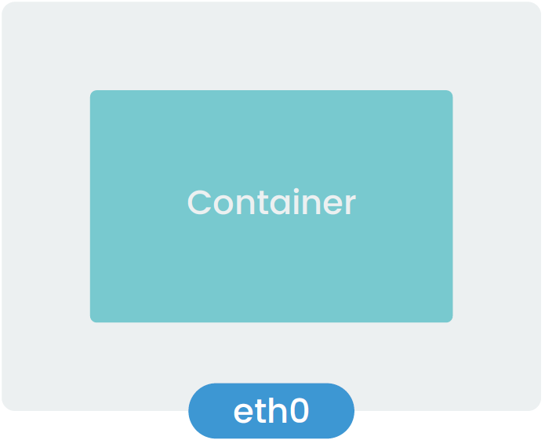
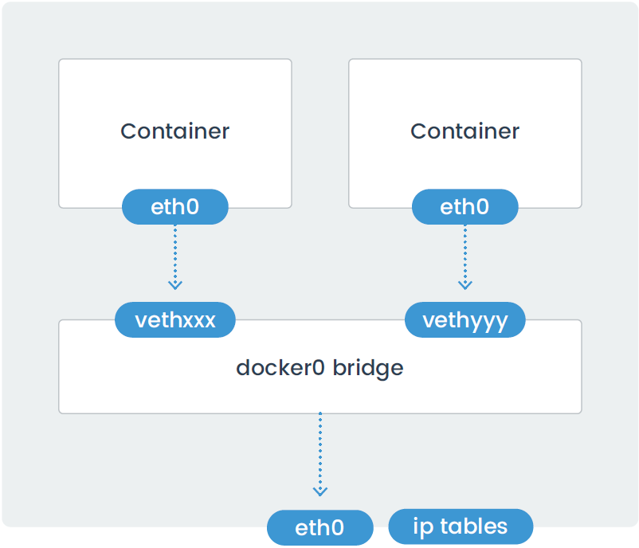
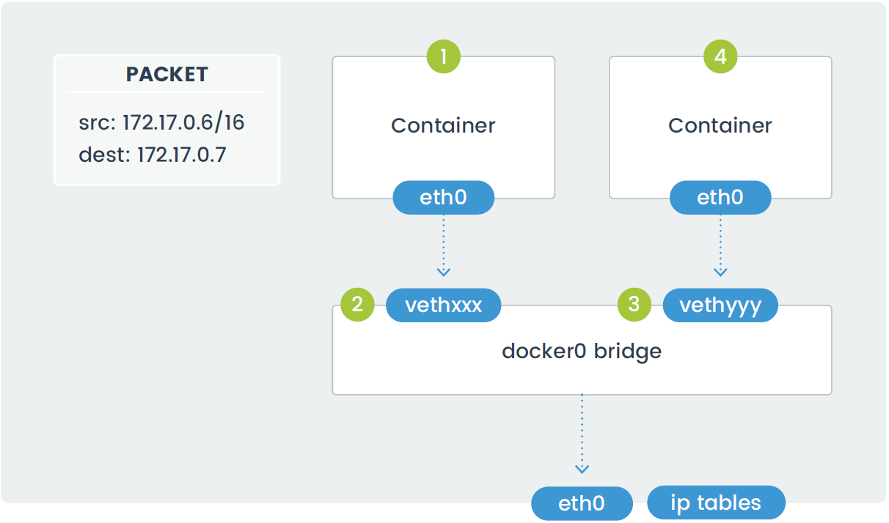

# Networking with Docker

- [Networking with Docker](#networking-with-docker)
  - [Docker Networking Types](#docker-networking-types)
    - [Host Networking](#host-networking)
    - [Bridge Networking](#bridge-networking)
    - [Custom Bridge Network](#custom-bridge-network)
    - [Container-Defined Network](#container-defined-network)
    - [No Networking](#no-networking)
  - [Container to container communication](#container-to-container-communication)

## Docker Networking Types

When a Docker container launches, the Docker engine assigns it a network interface with an IP address, a default gateway, and other components, such as a routing table and DNS services. By default, all addresses come from the same pool, and all containers on the same host can communicate with one another. We can change this by defining the network to which the container should connect, either by creating a custom user-defined network or by using a network provider plugin.

The network providers are pluggable using drivers. We connect a Docker container to a particular network by using the `--net` switch when launching it.

- The following command launches a container from the busybox image and joins it to the host network. This container prints its IP address and then exits.

    ```console
    docker run --rm --net=host busybox ip addr
    ```

- Command output:

    ```console
    Unable to find image 'busybox:latest' locally
    latest: Pulling from library/busybox
    729ce43e2c91: Pull complete 
    Digest: sha256:ad9bd57a3a57cc95515c537b89aaa69d83a6df54c4050fcf2b41ad367bec0cd5
    Status: Downloaded newer image for busybox:latest
    1: lo: <LOOPBACK,UP,LOWER_UP> mtu 65536 qdisc noqueue qlen 1000
        link/loopback 00:00:00:00:00:00 brd 00:00:00:00:00:00
        inet 127.0.0.1/8 scope host lo
            valid_lft forever preferred_lft forever
        inet6 ::1/128 scope host 
        valid_lft forever preferred_lft forever
    2: eth0: <BROADCAST,MULTICAST,UP,LOWER_UP> mtu 9001 qdisc mq qlen 1000
        link/ether 0a:c8:28:10:4f:a9 brd ff:ff:ff:ff:ff:ff
        inet 172.31.28.46/20 brd 172.31.31.255 scope global dynamic eth0
            valid_lft 2316sec preferred_lft 2316sec
        inet6 fe80::8c8:28ff:fe10:4fa9/64 scope link 
            valid_lft forever preferred_lft forever
    3: virbr0: <NO-CARRIER,BROADCAST,MULTICAST,UP> mtu 1500 qdisc noqueue qlen 1000
        link/ether 52:54:00:50:2c:a1 brd ff:ff:ff:ff:ff:ff
        inet 192.168.122.1/24 brd 192.168.122.255 scope global virbr0
           valid_lft forever preferred_lft forever
    4: virbr0-nic: <BROADCAST,MULTICAST> mtu 1500 qdisc fq_codel master virbr0 qlen 1000
        link/ether 52:54:00:50:2c:a1 brd ff:ff:ff:ff:ff:ff
    5: docker0: <NO-CARRIER,BROADCAST,MULTICAST,UP> mtu 1500 qdisc noqueue 
        link/ether 02:42:67:96:74:bc brd ff:ff:ff:ff:ff:ff
        inet 172.17.0.1/16 brd 172.17.255.255 scope global docker0
           valid_lft forever preferred_lft forever
    ```

Docker offers five network types, each with a different capacity for communication with other network entities:

- **Host Networking**: The container shares the same IP address and network namespace as that of the host. Services running inside of this container have the same network capabilities as services running directly on the host.

- **Bridge Networking**: The container runs in a private network internal to the host. Communication is open to other containers in the same network. Communication with services outside of the host goes through network address translation (NAT) before exiting the host. (This is the default mode of networking when the --net option isn't specified).

- **Custom bridge network**: This is the same as Bridge Networking but uses a bridge explicitly created for this (and other) containers. An example of how to use this would be a container that runs on an exclusive "database" bridge network. Another container can have an interface on the default bridge and the database bridge, enabling it to communicate with
both networks.

- **Container-defined Networking**: A container can share the address and network configuration of another container. This type enables process isolation between containers, where each container runs one service but where services can still communicate with one another on the localhost address.

**No networking**: This option disables all networking for the container.

### Host Networking

The host mode of networking allows the Docker container to share the same IP address as that of the host and disables the network isolation otherwise provided by network namespaces. The container’s network stack is mapped directly to the host’s network stack. All interfaces and addresses on the host are visible within the container, and all communication possible to or from the host is possible to or from the container.



- If you run the command *ip addr* on a host (or *ifconfig -a* if your host doesn’t have the ip command available), you will see information about the network interfaces.

    ```console
    ip addr
    ```

- Command output:

    ```console
    1: lo: <LOOPBACK,UP,LOWER_UP> mtu 65536 qdisc noqueue state UNKNOWN group default qlen 1000
        link/loopback 00:00:00:00:00:00 brd 00:00:00:00:00:00
        inet 127.0.0.1/8 scope host lo
           valid_lft forever preferred_lft forever
        inet6 ::1/128 scope host
           valid_lft forever preferred_lft forever
    2: eth0: <BROADCAST,MULTICAST,UP,LOWER_UP> mtu 9001 qdisc mq state UP group default qlen 1000
        link/ether 0a:c8:28:10:4f:a9 brd ff:ff:ff:ff:ff:ff
        inet 172.31.28.46/20 brd 172.31.31.255 scope global dynamic eth0
           valid_lft 3376sec preferred_lft 3376sec
        inet6 fe80::8c8:28ff:fe10:4fa9/64 scope link 
           valid_lft forever preferred_lft forever
    3: virbr0: <NO-CARRIER,BROADCAST,MULTICAST,UP> mtu 1500 qdisc noqueue state DOWN group default qlen 1000
        link/ether 52:54:00:50:2c:a1 brd ff:ff:ff:ff:ff:ff
        inet 192.168.122.1/24 brd 192.168.122.255 scope global virbr0
           valid_lft forever preferred_lft forever
    4: virbr0-nic: <BROADCAST,MULTICAST> mtu 1500 qdisc fq_codel master virbr0 state DOWN group default qlen 1000
        link/ether 52:54:00:50:2c:a1 brd ff:ff:ff:ff:ff:ff
    5: docker0: <NO-CARRIER,BROADCAST,MULTICAST,UP> mtu 1500 qdisc noqueue state DOWN group default 
        link/ether 02:42:67:96:74:bc brd ff:ff:ff:ff:ff:ff
        inet 172.17.0.1/16 brd 172.17.255.255 scope global docker0
           valid_lft forever preferred_lft forever
    ```

- If you run the same command from a container using host networking, you will see the same information.

    ```console
    docker run -it --rm --net=host busybox ip addr
    ```

- Command output:

    ```console
    1: lo: <LOOPBACK,UP,LOWER_UP> mtu 65536 qdisc noqueue qlen 1000
        link/loopback 00:00:00:00:00:00 brd 00:00:00:00:00:00
        inet 127.0.0.1/8 scope host lo
            valid_lft forever preferred_lft forever
        inet6 ::1/128 scope host 
            valid_lft forever preferred_lft forever
    2: eth0: <BROADCAST,MULTICAST,UP,LOWER_UP> mtu 9001 qdisc mq qlen 1000
        link/ether 0a:c8:28:10:4f:a9 brd ff:ff:ff:ff:ff:ff
        inet 172.31.28.46/20 brd 172.31.31.255 scope global dynamic eth0
           valid_lft 2149sec preferred_lft 2149sec
        inet6 fe80::8c8:28ff:fe10:4fa9/64 scope link 
            valid_lft forever preferred_lft forever
    3: virbr0: <NO-CARRIER,BROADCAST,MULTICAST,UP> mtu 1500 qdisc noqueue qlen 1000
        link/ether 52:54:00:50:2c:a1 brd ff:ff:ff:ff:ff:ff
        inet 192.168.122.1/24 brd 192.168.122.255 scope global virbr0
            valid_lft forever preferred_lft forever
    4: virbr0-nic: <BROADCAST,MULTICAST> mtu 1500 qdisc fq_codel master virbr0 qlen 1000
        link/ether 52:54:00:50:2c:a1 brd ff:ff:ff:ff:ff:ff
    5: docker0: <NO-CARRIER,BROADCAST,MULTICAST,UP> mtu 1500 qdisc noqueue 
        link/ether 02:42:67:96:74:bc brd ff:ff:ff:ff:ff:ff
        inet 172.17.0.1/16 brd 172.17.255.255 scope global docker0
            valid_lft forever preferred_lft forever
    ```

### Bridge Networking

In a standard Docker installation, the Docker daemon creates a bridge on the host with the name of *docker0*. When a container launches, Docker then creates a virtual ethernet device for it. This device appears within the container as *eth0* and on the host with a name like *vethxxx* where *xxx* is a unique identifier for the interface. The *vethxxx* interface is added to the *docker0* bridge, and this enables communication with other containers on the same host that also use the default bridge.

To demonstrate using the default bridge, run the following command on a host with Docker installed. Since we are not specifying the network - the container will connect to the default bridge when it launches.



- Run the **ip addr** and **ip route** commands inside of the container. You will see the IP address of the container with the *eth0* interface:

    ```console
    docker run -it --rm busybox /bin/sh
    ```

- *ip addr* command output:

    ```console
    1: lo: <LOOPBACK,UP,LOWER_UP> mtu 65536 qdisc noqueue qlen 1000
        link/loopback 00:00:00:00:00:00 brd 00:00:00:00:00:00
        inet 127.0.0.1/8 scope host lo
           valid_lft forever preferred_lft forever
    6: eth0@if7: <BROADCAST,MULTICAST,UP,LOWER_UP,M-DOWN> mtu 1500 qdisc noqueue 
        link/ether 02:42:ac:11:00:02 brd ff:ff:ff:ff:ff:ff
        inet 172.17.0.2/16 brd 172.17.255.255 scope global eth0
           valid_lft forever preferred_lft forever
    ```

- *ip route* command output:

    ```console
    default via 172.17.0.1 dev eth0 
    172.17.0.0/16 dev eth0 scope link  src 172.17.0.2
    ```

- In another terminal connected to the host, run the *ip addr* command. You will see the corresponding interface created for the container. In the image below it is named *veth65b3e57@if8*.

    ```console
    9: veth65b3e57@if8: <BROADCAST,MULTICAST,UP,LOWER_UP> mtu 1500 qdisc noqueue master docker0 state UP group default 
        link/ether 9e:b7:b7:12:75:89 brd ff:ff:ff:ff:ff:ff link-netnsid 0
        inet6 fe80::9cb7:b7ff:fe12:7589/64 scope link 
            valid_lft forever preferred_lft forever
    ```

Although Docker mapped the container IPs on the bridge, network services running inside of the container are not visible outside of the host. To make them visible, the Docker Engine must be told when launching a container to map ports from that container to ports on the host. This process is called publishing. For example, if you want to map port 80 of a container to port 8080 on the host, then you would have to publish the port as shown in the following command:

```console
docker run --name nginx -p 8080:80 nginx
```

By default, the Docker container can send traffic to any destination. The Docker daemon creates a rule within Netfilter that modifies outbound packets and changes the source address to be the address of the host itself. The Netfilter configuration allows inbound traffic via the rules that Docker creates when initially publishing the container's ports.

- command input `docker run -p 8080:80 --name web -d nginx`:

    ```console
    docker inspect web --format='{{json .NetworkSettings.IPAddress}}
    ```

- command output:

    ```console
    "172.17.0.2"
    ```

The output included below shows the Netfilter rules created by Docker when it publishes a container’s ports:

- Netfilter input command `sudo iptables -L -t nat -v`:

- command output of NAT table within Netfilter:

    ```console
    Chain PREROUTING (policy ACCEPT 2 packets, 104 bytes)
     pkts bytes target     prot opt in     out     source               destination         
        7   336 DOCKER     all  --  any    any     anywhere             anywhere             ADDRTYPE match dst-type LOCAL

    Chain INPUT (policy ACCEPT 2 packets, 104 bytes)
     pkts bytes target     prot opt in     out     source               destination         

    Chain OUTPUT (policy ACCEPT 20 packets, 1725 bytes)
     pkts bytes target     prot opt in     out     source               destination         
        0     0 DOCKER     all  --  any    any     anywhere            !localhost/8          ADDRTYPE match dst-type LOCAL

    Chain POSTROUTING (policy ACCEPT 20 packets, 1725 bytes)
     pkts bytes target     prot opt in     out     source               destination         
        0     0 MASQUERADE  all  --  any    !docker0  ip-172-17-0-0.ec2.internal/16  anywhere            
        1    40 RETURN     all  --  any    any     ip-192-168-122-0.ec2.internal/24  base-address.mcast.net/24 
        0     0 RETURN     all  --  any    any     ip-192-168-122-0.ec2.internal/24  255.255.255.255     
        0     0 MASQUERADE  tcp  --  any    any     ip-192-168-122-0.ec2.internal/24 !ip-192-168-122-0.ec2.internal/24  masq ports: 1024-65535
        0     0 MASQUERADE  udp  --  any    any     ip-192-168-122-0.ec2.internal/24 !ip-192-168-122-0.ec2.internal/24  masq ports: 1024-65535
        0     0 MASQUERADE  all  --  any    any     ip-192-168-122-0.ec2.internal/24 !ip-192-168-122-0.ec2.internal/24 
        0     0 MASQUERADE  tcp  --  any    any     ip-172-17-0-2.ec2.internal  ip-172-17-0-2.ec2.internal  tcp dpt:http

    Chain DOCKER (2 references)
     pkts bytes target     prot opt in     out     source               destination         
        0     0 RETURN     all  --  docker0 any     anywhere             anywhere            
        0     0 DNAT       tcp  --  !docker0 any     anywhere             anywhere             tcp dpt:http-alt to:172.17.0.2:80
    ```

- Netfilter input command `sudo iptables -L -t filter -v`:

- command output FILTER table within Netfilter:

    ```console
    Chain INPUT (policy ACCEPT 25507 packets, 2332K bytes)
     pkts bytes target     prot opt in     out     source               destination         
        0     0 ACCEPT     udp  --  virbr0 any     anywhere             anywhere             udp dpt:domain
        0     0 ACCEPT     tcp  --  virbr0 any     anywhere             anywhere             tcp dpt:domain
        0     0 ACCEPT     udp  --  virbr0 any     anywhere             anywhere             udp dpt:bootps
        0     0 ACCEPT     tcp  --  virbr0 any     anywhere             anywhere             tcp dpt:bootps

    Chain FORWARD (policy ACCEPT 0 packets, 0 bytes)
    pkts bytes target     prot opt in     out     source               destination         
        0     0 DOCKER-USER  all  --  any    any     anywhere             anywhere            
        0     0 DOCKER-ISOLATION-STAGE-1  all  --  any    any     anywhere             anywhere            
        0     0 ACCEPT     all  --  any    docker0  anywhere             anywhere             ctstate RELATED,ESTABLISHED
        0     0 DOCKER     all  --  any    docker0  anywhere             anywhere            
        0     0 ACCEPT     all  --  docker0 !docker0  anywhere             anywhere            
        0     0 ACCEPT     all  --  docker0 docker0  anywhere             anywhere            
        0     0 ACCEPT     all  --  any    virbr0  anywhere             ip-192-168-122-0.ec2.internal/24  ctstate RELATED,ESTABLISHED
        0     0 ACCEPT     all  --  virbr0 any     ip-192-168-122-0.ec2.internal/24  anywhere            
        0     0 ACCEPT     all  --  virbr0 virbr0  anywhere             anywhere            
        0     0 REJECT     all  --  any    virbr0  anywhere             anywhere             reject-with icmp-port-unreachable
        0     0 REJECT     all  --  virbr0 any     anywhere             anywhere             reject-with icmp-port-unreachable

    Chain OUTPUT (policy ACCEPT 25123 packets, 2181K bytes)
     pkts bytes target     prot opt in     out     source               destination         
        0     0 ACCEPT     udp  --  any    virbr0  anywhere             anywhere             udp dpt:bootpc

    Chain DOCKER (1 references)
    pkts bytes target     prot opt in     out     source               destination         
        0     0 ACCEPT     tcp  --  !docker0 docker0  anywhere             ip-172-17-0-2.ec2.internal  tcp dpt:http

    Chain DOCKER-ISOLATION-STAGE-1 (1 references)
     pkts bytes target     prot opt in     out     source               destination         
        0     0 DOCKER-ISOLATION-STAGE-2  all  --  docker0 !docker0  anywhere             anywhere            
        0     0 RETURN     all  --  any    any     anywhere             anywhere            

    Chain DOCKER-ISOLATION-STAGE-2 (1 references)
     pkts bytes target     prot opt in     out     source               destination         
        0     0 DROP       all  --  any    docker0  anywhere             anywhere            
        0     0 RETURN     all  --  any    any     anywhere             anywhere            

    Chain DOCKER-USER (1 references)
     pkts bytes target     prot opt in     out     source               destination         
        0     0 RETURN     all  --  any    any     anywhere             anywhere
    ```

### Custom Bridge Network

There is no requirement to use the default bridge on the host; it’s easy to create a new bridge network and attach containers to it. This provides better isolation and interoperability between containers, and custom bridge networks have better security and features than the default bridge.

- All containers in a custom bridge can communicate with the ports of other containers on that bridge. This means that you do not need to publish the ports explicitly. It also ensures that the communication between them is secure. Imagine an application in which a backend container and a database container need to communicate and where we also want to make sure that no external entity can talk to the database. We do this with a custom bridge network in which only the database container and the backend containers reside. You can explicitly expose the backend API to the rest of the world using port publishing.
- The same is true with environment variables - environment variables in a bridge network are shared by all containers on that bridge.
- Network configuration options such as MTU can differ between applications. By creating a bridge, you can configure the network to best suit the applications connected to it.

To create a custom bridge network and two containers that use it, run the following commands:

```console
docker network create mynetwork
docker run -it --rm --name=container-a --network=mynetwork busybox /bin/sh
docker run -it --rm --name=container-b --network=mynetwork busybox /bin/sh
```

### Container-Defined Network

A specialized case of custom networking is when a container joins the network of another container. The following commands launch two containers that share the same network namespace and thus share the same IP address. Services running on one container can talk to services running on the other via the *localhost* address.

```console
docker run -it --rm --name=container-a busybox /bin/sh
docker run -it --rm --name=container-b --network=container:container-a busybox /bin/sh
```

### No Networking

This mode is useful when the container does not need to communicate with other containers or with the outside world. It is not assigned an IP address, and it cannot publish any ports.

```console
docker run --net=none --name busybox busybox ip a
```

## Container to container communication

How do two containers on the same bridge network talk to one another?



In the above diagram, two containers running on the same host connect via the *docker0* bridge. If *172.17.0.6* (on the left-hand side) wants to send a request to *172.17.0.7* (the one on the right-hand side), the packets move as follows:

1. A packet leaves the container via *eth0* and lands on the corresponding *vethxxx* interface.
2. The *vethxxx* interface connects to the *vethyyy* interface via the *docker0* bridge.
3. The *docker0* bridge forwards the packet to the *vethyyy* interface.
4. The packet moves to the *eth0* interface within the destination container.

We can see this in action by using *ping* and *tcpdump*. Create two containers and inspect their network configuration with *ip addr* and *ip route*. The default route for each container is via the *eth0* interface.

Ping one container from the other, and let the command run so that we can inspect the traffic. Run *tcpdump* on the *docker0* bridge on the host machine. You will see in the output that the traffic moves between the two containers via the *docker0* bridge.

- From inside the container:

    ```console
    docker run -it --rm --name=container-a busybox /bin/sh
    ```

- Execute the ping command:

    ```console
    ping 8.8.8.8
    ```

    ```console
    PING 8.8.8.8 (8.8.8.8): 56 data bytes
    64 bytes from 8.8.8.8: seq=0 ttl=49 time=3.320 ms
    64 bytes from 8.8.8.8: seq=1 ttl=49 time=0.745 ms
    64 bytes from 8.8.8.8: seq=2 ttl=49 time=0.751 ms
    64 bytes from 8.8.8.8: seq=3 ttl=49 time=1.722 ms
    64 bytes from 8.8.8.8: seq=4 ttl=49 time=1.026 ms
    64 bytes from 8.8.8.8: seq=5 ttl=49 time=2.127 ms
    64 bytes from 8.8.8.8: seq=6 ttl=49 time=0.832 ms
    --- 8.8.8.8 ping statistics ---
    7 packets transmitted, 7 packets received, 0% packet loss
    round-trip min/avg/max = 0.745/1.503/3.320 ms
    ```

- Output of the ping command by tcpdump `sudo tcpdump -i docker0`:

    ```console
    tcpdump: verbose output suppressed, use -v or -vv for full protocol decode
    listening on docker0, link-type EN10MB (Ethernet), capture size 262144 bytes
    08:31:46.161909 IP6 ip-172-31-28-46 > ff02::16: HBH ICMP6, multicast listener report v2, 2 group record(s), length 48
    08:31:46.497936 IP6 ip-172-31-28-46 > ff02::16: HBH ICMP6, multicast listener report v2, 2 group record(s), length 48
    08:32:58.072563 ARP, Request who-has ip-172-17-0-1.ec2.internal tell ip-172-17-0-2.ec2.internal, length 28
    08:32:58.072591 ARP, Reply ip-172-17-0-1.ec2.internal is-at 02:42:67:96:74:bc (oui Unknown), length 28
    08:32:58.072597 IP ip-172-17-0-2.ec2.internal > dns.google: ICMP echo request, id 7, seq 0, length 64
    08:32:58.073247 IP dns.google > ip-172-17-0-2.ec2.internal: ICMP echo reply, id 7, seq 0, length 64
    08:32:59.072750 IP ip-172-17-0-2.ec2.internal > dns.google: ICMP echo request, id 7, seq 1, length 64
    08:32:59.073439 IP dns.google > ip-172-17-0-2.ec2.internal: ICMP echo reply, id 7, seq 1, length 64
    08:33:00.072940 IP ip-172-17-0-2.ec2.internal > dns.google: ICMP echo request, id 7, seq 2, length 64
    08:33:00.073642 IP dns.google > ip-172-17-0-2.ec2.internal: ICMP echo reply, id 7, seq 2, length 64
    08:33:01.073127 IP ip-172-17-0-2.ec2.internal > dns.google: ICMP echo request, id 7, seq 3, length 64
    08:33:01.074790 IP dns.google > ip-172-17-0-2.ec2.internal: ICMP echo reply, id 7, seq 3, length 64
    08:33:02.073324 IP ip-172-17-0-2.ec2.internal > dns.google: ICMP echo request, id 7, seq 4, length 64
    08:33:02.074291 IP dns.google > ip-172-17-0-2.ec2.internal: ICMP echo reply, id 7, seq 4, length 64
    08:33:03.073546 IP ip-172-17-0-2.ec2.internal > dns.google: ICMP echo request, id 7, seq 5, length 64
    08:33:03.075614 IP dns.google > ip-172-17-0-2.ec2.internal: ICMP echo reply, id 7, seq 5, length 64
    08:33:03.105921 ARP, Request who-has ip-172-17-0-2.ec2.internal tell ip-172-17-0-1.ec2.internal, length 28
    08:33:03.105998 ARP, Reply ip-172-17-0-2.ec2.internal is-at 02:42:ac:11:00:02 (oui Unknown), length 28
    08:33:04.073746 IP ip-172-17-0-2.ec2.internal > dns.google: ICMP echo request, id 7, seq 6, length 64
    08:33:04.074520 IP dns.google > ip-172-17-0-2.ec2.internal: ICMP echo reply, id 7, seq 6, length 64
    ```
