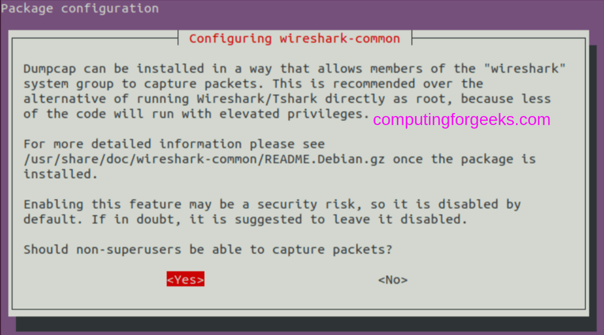

# GNS3 server configuration on an EC2 instance

The purpose of this repository is to deploy a GNS3 server on an EC2 instance of AWS. The following figure shows the basic architecture of the deployment to be implemented:


To perform the right deployment follow each of the following steps:

1. We assume that we have an EC2 instance deployed with Ubuntu Server 20.04 as OS:
    

2. The following rules apply for opening incoming connections from:

    | Type        | Port      | Description                                                     |
    |-------------|-----------|-----------------------------------------------------------------|
    | SSH         | 22        | Instance management                                             |
    | Custom TCP  | 3080      | GNS3 client-server connection                                   |
    | Custom TCP  | 5000-5030 | Telnet connection for the device management created within GNS3 |

    - Example of applied rules
    
    

3. GNS3 server installation:

    ```console
    sudo apt update
    sudo add-apt-repository ppa:gns3/ppa
    sudo apt install gns3-server gns3-gui
    ```

    - It is recommended accept both options as part of the installation process:

    | Users able to run GNS3| Users able to capture packages |
    |-------------|-----------|
    |  |  |

    
4. IOU (IOS over Unix) is an internal Cisco tool for simulating the ASICs in Cisco Switches. This enables you to play with Layer 2 switching in the Labs:

    ```console
    sudo dpkg --add-architecture i386
    sudo apt update
    sudo apt install gns3-iou
    ```

5. Install docker on ubuntu:

-  Step 1: Update System

    ```console
    sudo apt -y update
    ```
- Step 2: Install basic dependencies
    ```console
    sudo apt -y install apt-transport-https ca-certificates curl gnupg-agent software-properties-common
    ```

- Step 3: Install Docker CE on Ubuntu 22.04|20.04|18.04
    - If you have older versions of Docker, remove it and its dependent packages.

    ```console
    sudo apt remove docker docker-engine docker.io containerd runc
    ```
    - Import Docker repository GPG key:

    ```console
    curl -fsSL https://download.docker.com/linux/ubuntu/gpg | sudo gpg --dearmor -o /etc/apt/trusted.gpg.d/docker-archive-keyring.gpg
    ```
    - You can then add Docker CE repository to Ubuntu

    ```console
    sudo add-apt-repository "deb [arch=amd64] https://download.docker.com/linux/ubuntu $(lsb_release -cs) stable"
    ```
    
    - Finally install Docker CE on Ubuntu22.04|20.04|18.04:

    ```console
    sudo apt update
    sudo apt install docker-ce docker-ce-cli containerd.io
    ```

    - Add your user account to docker group.

    ```console
    sudo usermod -aG docker $USER
    newgrp docker
    ```
    
    - Verify installation by checking Docker version:

    ```console
    docker version
    ```

    - After installing Docker and IOU, add your user to the following groups:

    ```console
    for i in ubridge libvirt kvm wireshark docker; do
        sudo usermod -aG $i $USER
    done
    ```

5. Run GNS3 server:

    ```console
    $ gns3
    ```

## To Do

1. Enable secure connection between the client and server via TLS
