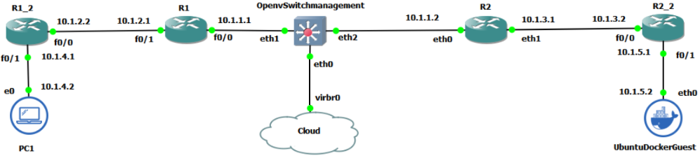

# GNS3 Network Deployment

- [GNS3 Network Deployment](#gns3-network-deployment)
  - [Pre-requisitos](#pre-requisitos)
  - [Instalación de Dispositivos](#instalación-de-dispositivos)
  - [Despliegue de la red Tipo](#despliegue-de-la-red-tipo)
    - [Configuración de interfaces en enrutadores](#configuración-de-interfaces-en-enrutadores)
    - [Configuración de OSPF en los enrutadores](#configuración-de-ospf-en-los-enrutadores)
    - [Configuración de OpenVswitch](#configuración-de-openvswitch)
- [Expansión de red](#expansión-de-red)
  - [Router](#router)
  - [Host](#host)
  - [Añadir protocolo OSPF](#añadir-protocolo-ospf)
- [Introducción atacante](#introducción-atacante)
  - [Preparación Sistema Operativo](#preparación-sistema-operativo)

Esta sección establece los procedimientos para descargar y configurar la red GNS3.

## Pre-requisitos

- Tener la instancia `t2.large` (*GNS3-Server*) desplegada
- Conexión a dicha instancia vía `ssh`.
- Conexión vía GNS3 client a esa instancia.
  - Implica tener abierto el puerto 3080 (Detalle comentado en la [instalación de GNS3](../../GNS3ServerDeployment/README.md#deploy-gns3-server)).
- Conexión vía Telnet a esa instancia.
  - Implica tener abierto el rango de puertos 5000 - 50010 (Detalle comentado en la [instalación de GNS3](../../GNS3ServerDeployment/README.md#deploy-gns3-server)).

## Instalación de Dispositivos

- La carpeta `ApplianceImageGNS3` contiene todas las imágenes que serán importadas de la siguiente manera, usando la de `cisco-3725` como muestra:

1. Se descarga la imagen correspondiente al router `cisco-3725` ubicada en `~/TelematicsNetworkDesign/SDN-Lab/ApplianceImageGNS3`.
2. Después, en GNS3, vamos a *File*, *Import appliance*, se localiza el directorio donde se tiene la *imágen descargada* y *Abrir*.
3. Seleccionar instalar el dispositivo en el servidor principal:

    

4. Seleccionar la imagen del router `cisco-3725`:

    

5. Aceptar la instalación de la imagen del router `cisco-3725`:

    

6. Terminar el proceso de instalación de la imagen del router `cisco-3725`:

    

7. Recibir mensaje de imagen del router `cisco-3725` instalada:

    

8. Verificar que la imagen del router `cisco-3725` ha sido instalada

    

## Despliegue de la red Tipo

1. Crear un nuevo proyecto en `File` y `New blank project` para empezar a desplegar la red.
2. Se deben importar los appliance según la arquitectura siguiente, así como conectarlos entre si:

  

> Note: Por defecto al importar el *appliance* Open vSwitch aparece con un ícono que debe ser cambiado

  

### Configuración de interfaces en enrutadores

- Para R1:

  ```console
  configure terminal
  interface f0/0
  ip address 10.1.1.1 255.255.255.0
  no shutdown
  end
  ```

  ```console
  configure terminal
  interface f0/1
  ip address 10.1.2.1 255.255.255.0
  no shutdown
  end
  ```

  - Se guardara la configuración del enrutador R1 introduciendo el comando:

  ```console
  copy running-config startup-config
  ```

- Para R3

  ```console
  configure terminal
  interface f0/0
  ip address 10.1.2.2 255.255.255.0
  no shutdown
  end
  ```

  ```console
  configure terminal
  interface f0/1
  ip address 10.1.4.1 255.255.255.0
  no shutdown
  end
  ```

  - Se guardara la configuración del enrutador R1_1 introduciendo el comando:

  ```console
  copy running-config startup-config
  ```

- Para R2

  ```console
  configure terminal
  interface f0/0
  ip address 10.1.1.2 255.255.255.0
  no shutdown
  end
  ```

  ```console
  configure terminal
  interface f0/1
  ip address 10.1.3.1 255.255.255.0
  no shutdown
  end
  ```

  - Se guardara la configuración del enrutador R2 introduciendo el comando:

  ```console
  copy running-config startup-config
  ```

- Para R4

  ```console
  configure terminal
  interface f0/0
  ip address 10.1.3.2 255.255.255.0
  no shutdown
  end
  ```

  ```console
  configure terminal
  interface f0/1
  ip address 10.1.5.1 255.255.255.0
  no shutdown
  end
  ```

  - Se guardara la configuración del enrutador R2_2 introduciendo el comando:

  ```console
  copy running-config startup-config
  ```

### Configuración de OSPF en los enrutadores

- Para hacer que los routers operen bajo el protocolo habrá que configurarlos de la siguiente manera (todos igual).

  ```console
  configure terminal
  router ospf 1
  network 10.0.0.0 0.255.255.255 area 0
  default-information originate
  end
  ```

- Se guardara la configuración del enrutador R2_2 introduciendo el comando:

  ```console
  copy running-config startup-config
  ```

- Debería existir comunicación entre routers, por ejemplo de R1 a R4:

  ```console
  R1#ping 10.1.5.1

  Type escape sequence to abort.
  Sending 5, 100-byte ICMP Echos to 10.1.5.1, timeout is 2 seconds:
  !!!!!
  Success rate is 100 percent (5/5), round-trip min/avg/max = 24/30/36 ms
  ```

- Se podría comprobar la existencia de vecinos:

  ```console
  R1#show ip ospf neighbor

  Neighbor ID     Pri   State           Dead Time   Address         Interface
  10.1.3.1          1   FULL/DR         00:00:30    10.1.1.2        FastEthernet0/0
  10.1.4.1          1   FULL/DR         00:00:31    10.1.2.2        FastEthernet0/1
  ```

### Configuración de OpenVswitch

Ahora que tenemos los routers configurados tratamos de conectarlos via OpenVSwitch. Para obtener el dispositivo, seguimos los pasos del caso de los routers con la imagen de la carpeta de nombre openvswitch-management-fixed.

Después, se añade al proyecto y se le tiene que dar acceso a internet para que pueda hacerse la conexión con el controlador.
Para conectar el OVS a internet hay que añadir una cloud al proyecto. Es importante acceder a la configuración de la cloud y añadirle en las conexiones la interfaz de red virbr0. A continuación, se debe conectar la interfaz del switch eth0 con la nube mediante la mencionada virbr0. Se puede revisar en el terminal la IP correspondiente a esta interfaz de red.

Una vez conocida la IP de la interfaz de red, se procede a configurar OVS para tener acceso a internet, y, por consiguiente, a la instancia donde estará desplegado el controlador. Para conseguir esto se requieren dar dos pasos: asignarle una IP adecuada a la interfaz eth0 y abrir un gateway hacia la interfaz de red que dará acceso a internet

```
ifconfig eth0 192.168.122.20
ip route add default via 192.168.122.1
```
Se comprobará la conexión haciendo:

```
ping 8.8.8.8
ping (ip de la instancia del controlador)
```

Antes de realizar la conexión con el controlador, es recomendable fijar algunos parámetros de la configuración para el controlador del OVS. En este caso ha sido necesario fijar el protocolo y habilitar el flujo en br0.

```
ovs-vsctl set bridge br0 protocols=OpenFlow13
ovs-vsctl set bridge br0 other_config:enable-flush=true
```

Una vez establecidos estos parámetros se procede a conectar el OVS con el controlador. OpenDayLight ha de estar lanzado en el momento que se intente hacer la conexión.  La conexión se hará con el puerto 6633 o el 6653, los puertos definidos para OpenFlow.

```
ovs-vsctl set-controller br0 tcp:ip_instancia:6633
```

Ahora si conectamos R1 a la interfaz eth1 del switch y R2 a la eth2, si está correctamente configurado podremos hacer ping de uno a otro. Además, es recomendable ver las tablas de flujo que se han establecido e ir entendiendo el funcionamento del sistema.

Los siguientes comandos son una colección de comandos útiles para comprobar si la conexión y configuración es correcta y/o comprobar las tablas de flujo establecidas por el controlador. 

```
ovs-vsctl list controller
ovs-vsctl list bridge br0
ovs-ofctl -O OpenFlow13 dump-flows br0
ovs-ofctl -O OpenFlow13 dump-ports br0
```

# Expansión de red
En este momento tenemos una red formada por un switch y dos routers (además de la nube para conectarse al controlador). El siguiente paso será expandir la red la red añadiendole más routers y dos nodos.

Vamos a añadir un router más a cada lado del switch, pero, más adelante veremos que uno de ellos requiere ser de otro tipo, asique, en este paso añadiremos un router y un nodo (un lado del switch). El router del otro lado veremos en el siguiente apartado como integrarlo, y el nodo se añadirá de igual manera.

## Router
Arrastraremos al proyecto un router del mismo modelo del que el otro. Del mismo modo que haciamos antes, configuraremos las interfaces del router. Pero antes habra que configurar una nueva interfaz en R1. Para ello

```
configure terminal
interface eth1
ip address 10.1.2.1 255.255.255.0
no shutdown
end
```

Para el nuevo router, que llamaremo R1_2

```
configure terminal
interface eth0
ip address 10.1.2.2 255.255.255.0
no shutdown
exit
interface eth1
ip address 10.1.4.1 255.255.255.0
no shutdown
end
```

Las direcciones ip se pueden poner las que quieran, siempre que sean válidas, para hacerlas más entendibles para el lector.


## Host
El VPSC, disponible por defecto en GNS3, es el hosts que conectaremos al extremo de la red. La configuración a aplicar en este caso es simplemente agregar las IPs en las interfaces que se conectan. 

```
show ip
ip 10.1.5.2/8 10.1.5.1
dns 10.1.5.1
```


## Añadir protocolo OSPF
Para hacer que los routers operen bajo el protocolo habrá que configurarlos de la siguiente manera (todos igual).

```
configure terminal
router ospf 1
network 10.0.0.0 0.255.255.255 area 0
default-information originate
end
```

Se podrán comprobar los estados de las interfaces y las relaciones de vecindad establecidas con los siguientes comandos.

```
show ip interface brief
show ip ospf nei
```

# Introducción atacante
FRR habrá que descargarlo (disponible en Imagenes) y, posteriormente, configurarlo para integrarlo en la red, por una parte, y añadirle el programa de ataque por otra. 

Durante el proceso de importarlo a GNS3 habrá que elegir la versión de FRR que se desea implementar y descargar los archivos requeridos para ello, lo cual se puede hacer directamente desde GNS3.

Por otra parte, al agregarlo al proyecto se nos pedirá que hagamos ciertos cambios en la configuración del servidor GNS3. Estos cambios consisten en añadir la línea enable_kvm=False debajo de [Qemu] en el archivo gns3_server.conf de etc/gns3.
Ahora el dispositivo se podrá añadir al proyecto e integrarlo en la red. Para integrarlo habrá que asignar IPs a las interfaces que se deseen conectar, además de configurar el enrutamiento OSPF.
Para lo primero, en este caso se va a realizar la configuración para las interfaces eth1 y eth2. Se ha de señalar que la interfaz de los dispositivos Cisco y FRR son muy similares, lo que facilita en gran medida la labor del programador. Para configurar las interfaces (del mismo modo las dos):

```
configure terminal
interface eth0
ip address 10.1.1.2/24
no shutdown
end
```
Para lo segundo será necesario hacer

```
configure terminal
router ospf
network 10.0.0.0/8 area 0
default-information originate
end
```

## Preparación Sistema Operativo
Con el dispositivo FRR configurado de esta manera estará listo para ser integrado en la red, establecer relaciones de vecindad con los rúters colindantes y enrutar paquetes. Lo que quedará será preparar el sistema operativo para la integración del programa de ataque.
Son varios los requisitos previos que debe cumplir el sistema operativo:
  •	Máquina Linux
  •	Python 2.7
  •	Scapy
  
Antes de todo hay que dar acceso a internet a la máquina. Para ello usando la herramienta cloud de GNS3 y usando la interfaz gráfica virbr0, tal y como se observa en la siguiente figura, se procede a configurar la interfaz eth2 de la máquina.


En primer lugar, hay que asignar una IP a la interfaz eth2, y por otra hay que generar un gateway por defecto para dar acceso a internet vía virbr0. Esto se hará haciendo uso de los siguientes comandos

```
ifconfig eth0 192.168.122.21
route add defautl gw 192.168.122.1 eth0
echo "nameserver 8.8.8.8" | tee /etc/resolv.conf > /dev/null
```
Una vez hecho esto, se procederá a instalar Python. Como siempre, es recomendable actualizar los repositorios. Después, se procederá a la instalación Python. 

```
apk update && apk upgrade –available
apk add --update python2
```
Como apunte, cabe destacar que la distribución de este dispositivo con FRR es una Alpine. Por lo tanto, ciertos comandos típicos, como apt, correapondientes a otras distribuciones deberán sustituirse por apk. Este proceso se realizará en tres pasos. Primero, se debe instalar el sistema de control de versiones Git:

```
apk add --update git
```

En segundo lugar, consulta un clon del repositorio de Scapy. Y para finalizar, instalar Scapy.

```
git clone https://github.com/secdev/scapy.git
cd scapy
python setup.py install
```
Por último, quedará instalar la librería libpcap necesaria para capturar paquetes. Para obtenerla se hará

```
apk add --upgrade libpcap-dev
```


