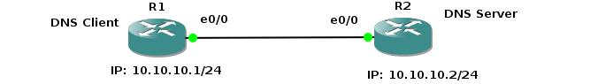

# DNS Server Basic Configuration

## Introduction

Domain Name Service is what resolve hostname to IP addresses. When you have DNS server running on your network, you don’t have to type the IP address of the host you want to connect to or ping as long as a hostname is set. You just type the hostname, Internet name or Fully qualified domain name(fqdn) and DNS server work out the rest for you. DNS Server listens on UDP port 53.

We’ll use topology shown below to setup DNS server. R1 will use R2 as DNS server to make DNS resolutions.

   

First, let’s begin with R1. We’ll setup hostname and IP related information.

- R1 ip Configurations

    ```console
    enable
    configure terminal
    hostname R1
    interface e0/0
    ip address 10.10.10.1 255.255.255.0
    no shut
    do wr 
    end
    ```

- R2 IP and Hostname Configurations

    ```console
    enable
    config t
    hostaname R2
    int e0/0
    ip address 10.10.10.2 255.255.255.0
    no shut
    do wr
    end
    ```

- Setting up R2 as DNS Server

    ```console
    config t
    ip dns server
    ip host loopback.R2.com 2.2.2.2
    ```

    We mapped loopback.R2.com to ip address 2.2.2.2. Currently, we don’t have 2.2.2.2, we could create loopback interface on R2 and assign ip 2.2.2.2

    ```console
    interface loopback 1
    ip address 2.2.2.2 255.255.255.255
    end
    ```

    Let’s verify that loopback interface we just created is working.This will show us that the hostname correctly setup locally on R2.

    ```console
    ping loopback.R2.com
    ```

    Now it’s time to setup R1 to resolve hostname using R2.On R1 type;

    ```console
    config terminal 
    ip domain lookup
    ip name-server 10.10.10.2
    ```

    Set R1 to use R2 as the default gateway to get to the loopback interface on R2. So that after R1 resolve loopback.R2.com, it can reach 2.2.2.2 through its default route (R2).

- on R1 type:

    ```console
    config t
    ip route 0.0.0.0  0.0.0.0 10.10.10.2
    end
    ```

    This tells our router that to get to any network not in its routing table, it’s next hop is 10.10.10.2 which is our router R2.

    We can turn on DNS udp port debug command so that we can see what’s going on on R1.

    ```console
    debug ip udp
    ```

    Now on R1, do a ping to loopback.R2.com and you should get a success message.

    ```console
    ping loopback.R2.com repeat 3
    ```

- Use Wireshark
  - If you captured the traffic, you’ll see DNS query and Answer as shown in Wireshark capture screenshot below

   
