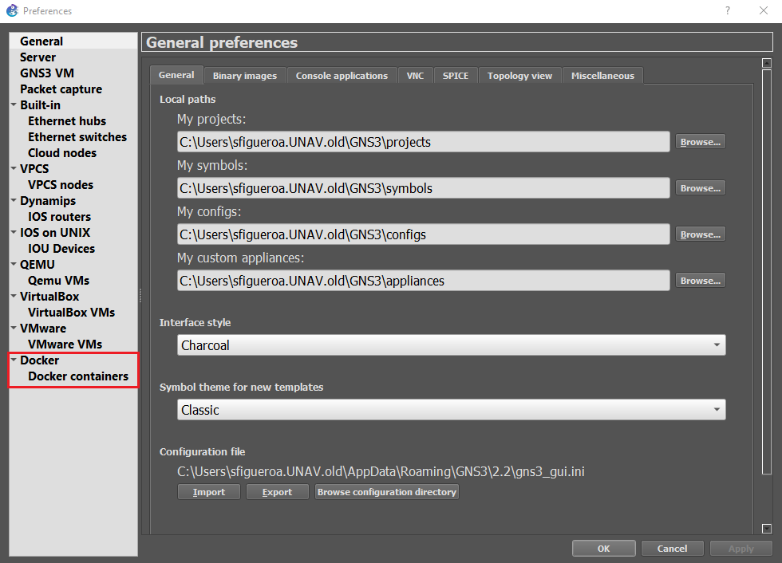
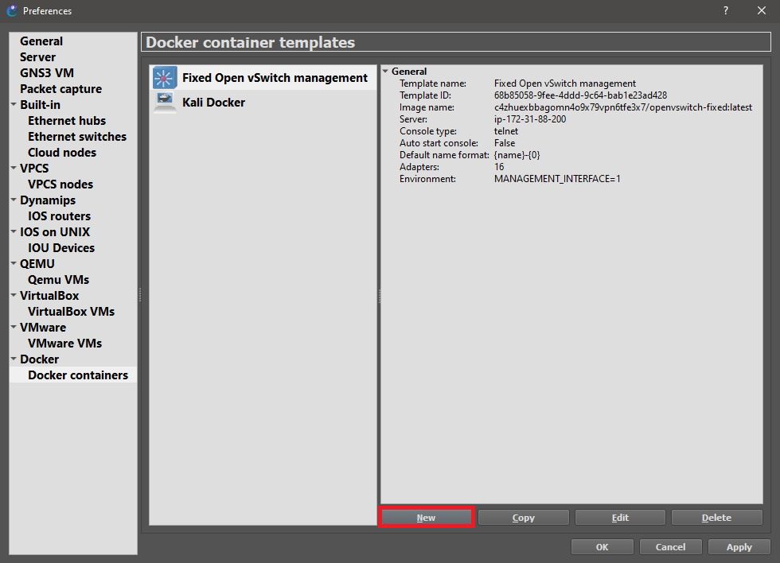
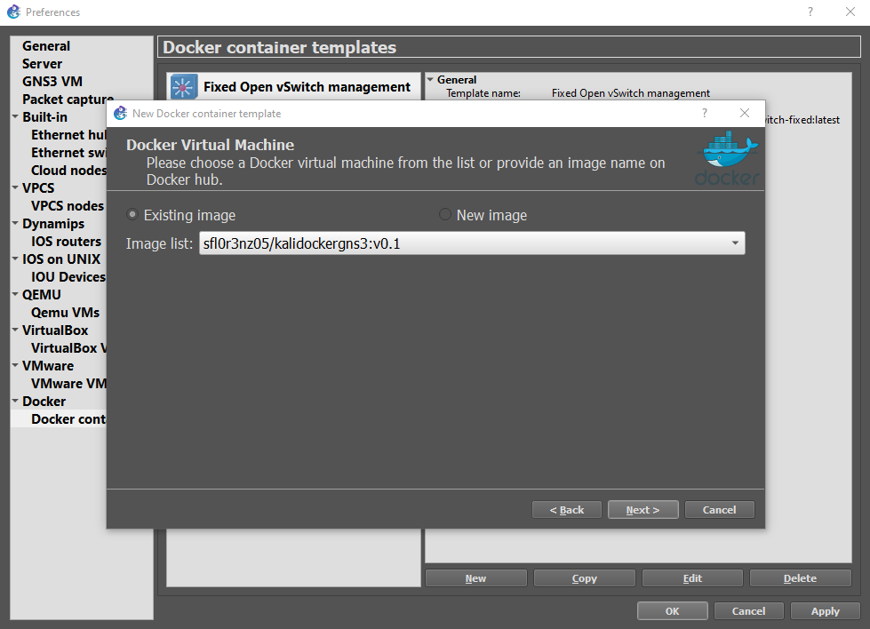
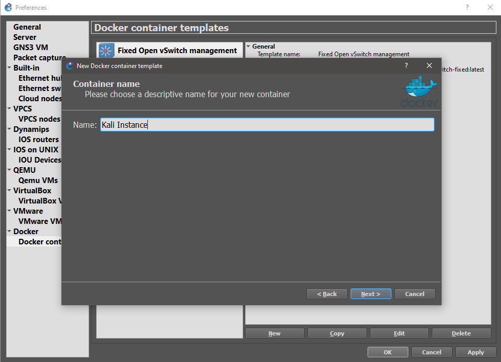
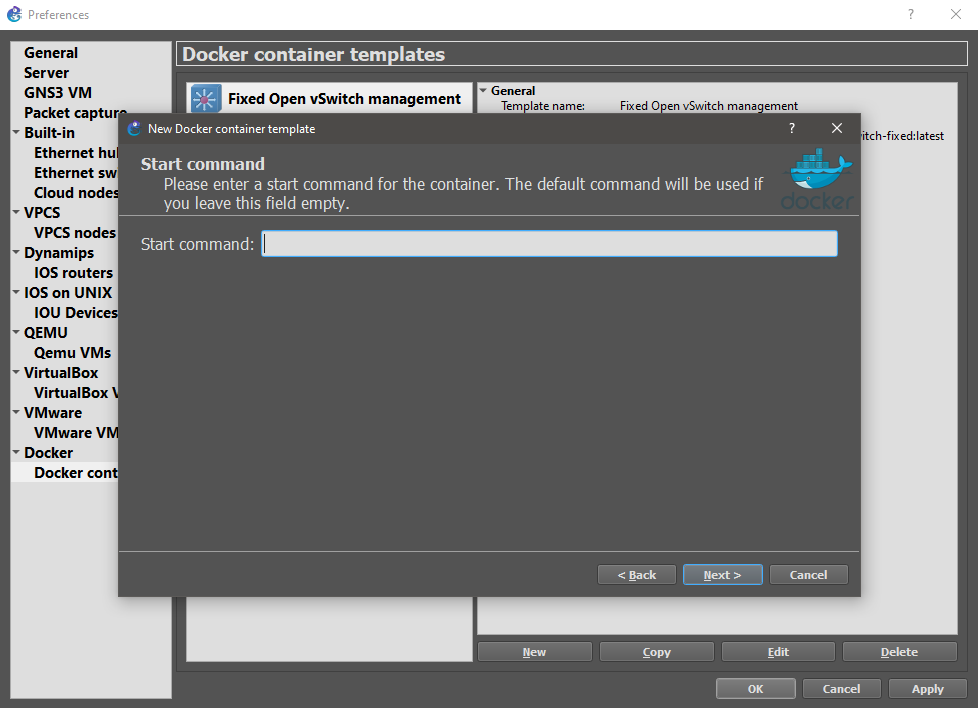
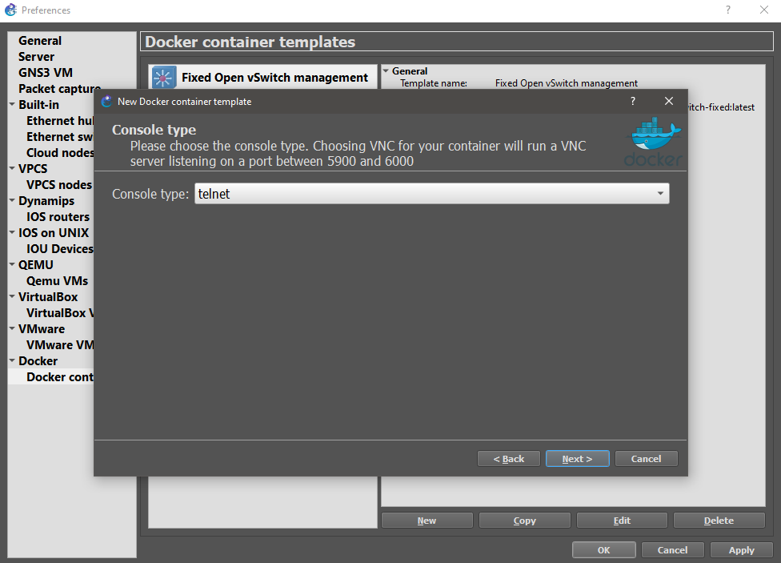
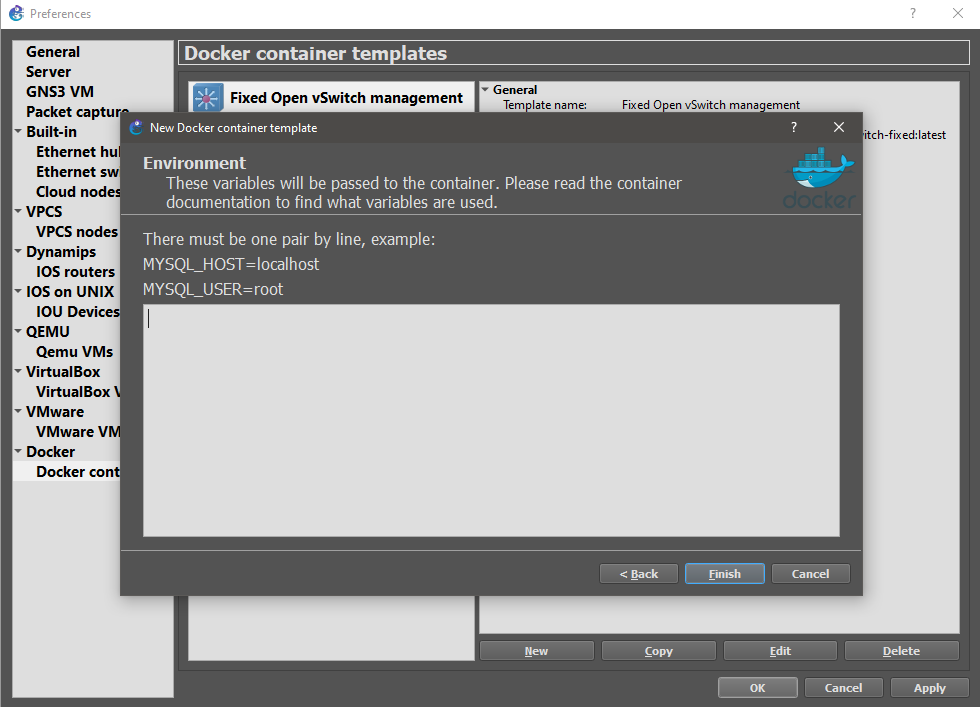
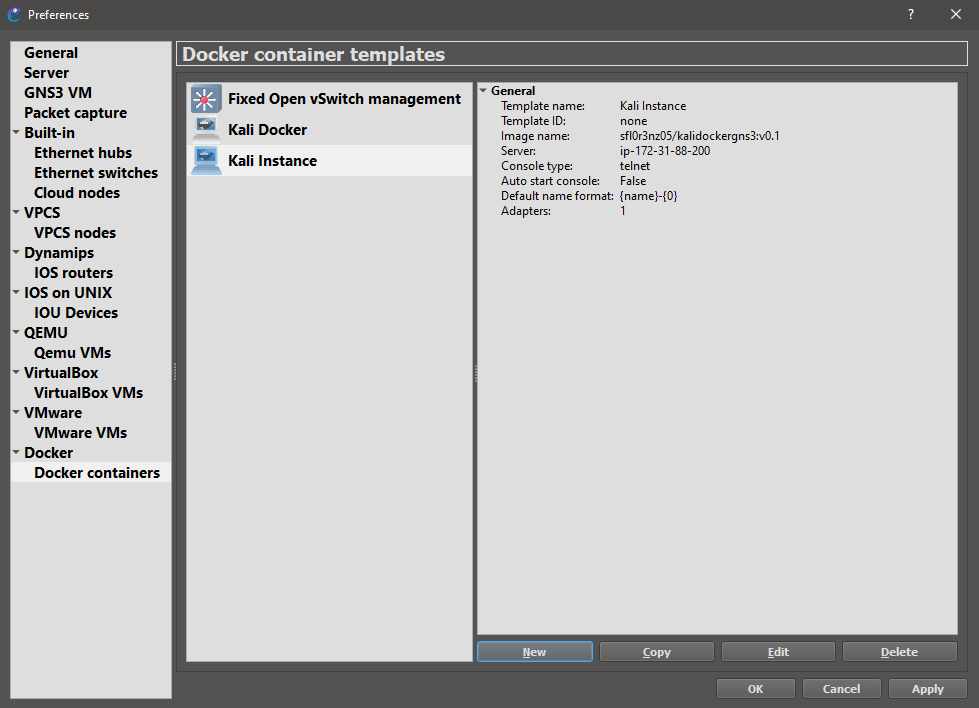

# GNS3 Import Docker

1. Select Docker containers in the preferences:

    

2. Create a new importation:

    

3. Select the docker image:

    

4. Create a new importation:

    

5. Name the device:

    

6. Leave this feature in blank:

    

7. Select the terminal protocol:

    

8. Leave this feature in blank:

    

9. The device has been created:

    