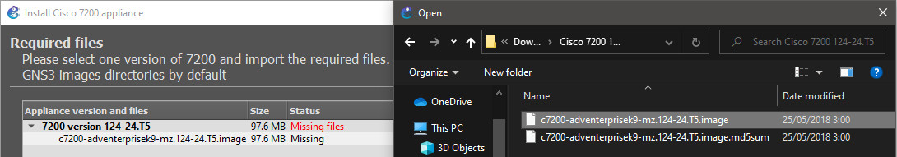
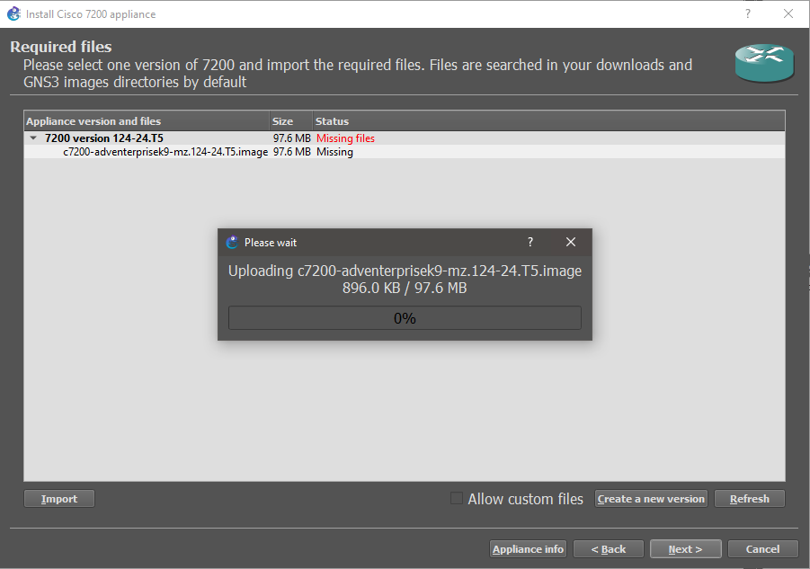
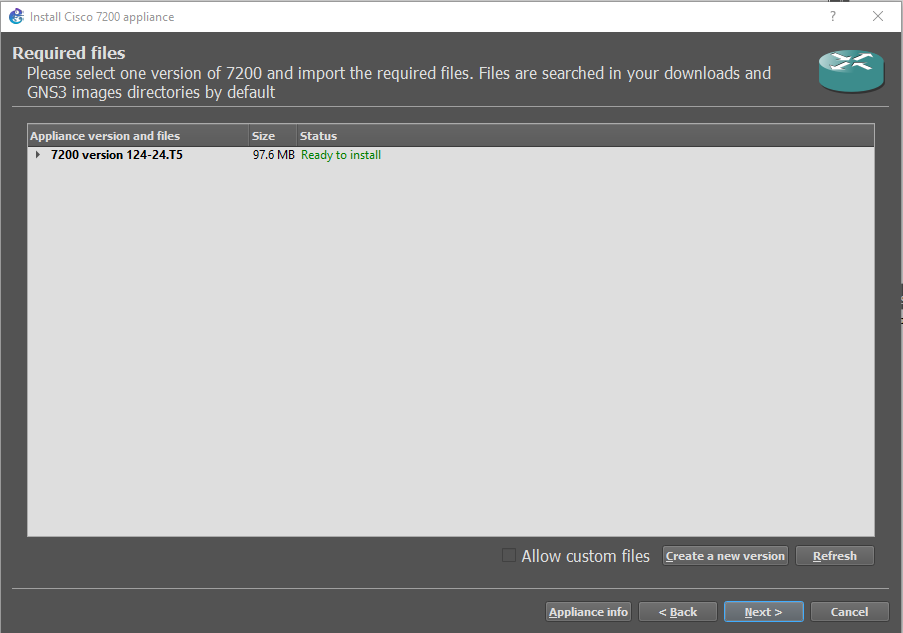

# GNS3 Missing Images

1. Descargar la imagen requerida del siguiente [enlace](https://drive.google.com/drive/u/1/folders/1Kc4y-Arzkp51sjSfxCjFXhwfgJGEnkzS).

2. Seleccionar la imagen en el host donde está instalado el cliente GNS3:

    

3. Iniciar la carga de la imagen seleccionada:

    

4. La imagen quedará satisfactoriamente cargada:

    
